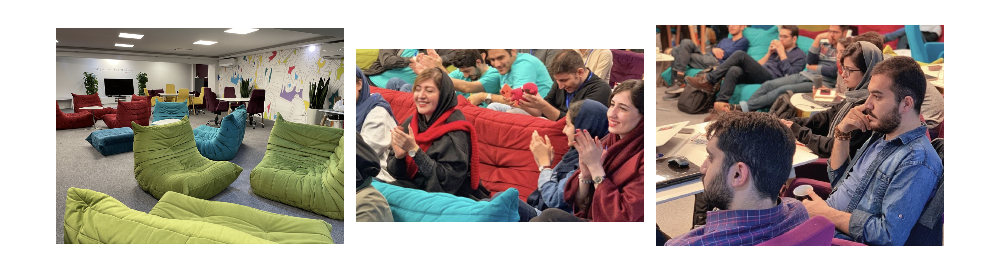
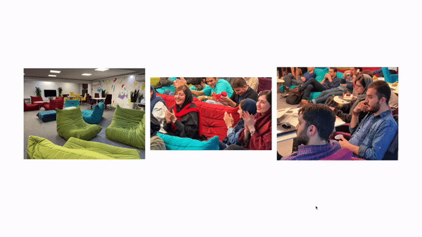

<h1>پورتفولیو (۲۵۰ امتیاز)</h1>

در این مساله شما باید پورتفولیویی همانند تصویر زیر پیاده‌سازی کنید، به گونه‌ای که ویژگی‌های زیر را داشته باشد:
  

<li dir="rtl">
مانند تصویر زیر، سه عکس در صفحه وجود داشته باشد و هر عکس یک متن توضیحات مخصوص به خود را دارد که در حالت عادی مخفی است.  
</li> 

<li dir="rtl">
با هاور روی عکس‌ها، عکس‌ها تار شده و متن توضيحات هر عکس در وسط عکس تار شده نمایان می‌شود.
</li> 

<li dir="rtl">
در صورتی که سايز اسکرین بزرگتر از ۷۶۹ پیکسل باشد، سه عکس به صورت افقی کنار هم قرار بگیرند.
</li> 

<li dir="rtl">
در صورتی که اندازه اسکرین کمتر یا مساوی ۷۶۹ پیکسل بود سه عکس به صورت ستونی در کنار هم قرار بگیرند و عکس ها با فاصله ۲۰ پیکسل از طرفين عرض صفحه را پر کنند و ارتفاع هم نسبت به اندازه اصلی عکس تعیین گردد.
</li> 

